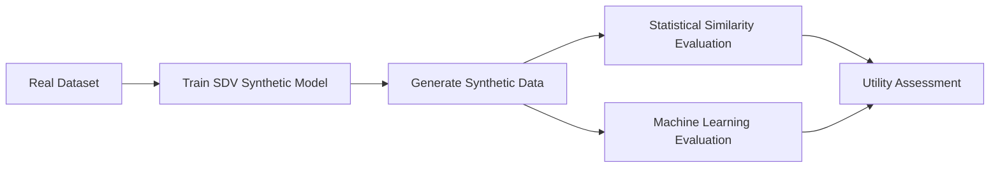

# Synthetic Data for Data Privacy
This project demonstrates how **synthetic data** can be generated to protect sensitive information while maintaining the **statistical properties of real datasets**.

The project uses the **SDV (Synthetic Data Vault)** library to generate synthetic tabular data and evaluates the usability of the generated data using machine learning models.

# Project Overview
Many organizations cannot share real datasets due to **privacy, security, or regulatory constraints**.  

Synthetic data provides a solution by generating artificial data that:
- preserves statistical patterns
- protects sensitive information
- allows safe data sharing

This notebook demonstrates a full pipeline:
1. Load real dataset
2. Train synthetic data generator
3. Generate synthetic dataset
4. Compare distributions
5. Evaluate ML performance

# Dataset
Dataset used in this project:

**Adult Income Dataset (UCI Machine Learning Repository)**

The dataset contains demographic and employment attributes used to predict whether income exceeds \$50K/year.

# Technologies Used
- Python
- Pandas
- SDV
- Faker
- XGBoost
- LightGBM
- Scikit-learn

# Pipeline

# Model Evaluation
The performance of models trained on Real data and Synthetic data is compared to evaluate **data utility**.

Metrics used:
- Accuracy
- Precision
- Recall
- F1 Score

# Key Takeaways
- Synthetic data can protect sensitive information
- Generated data can still be useful for ML models
- Privacy-preserving techniques are important for modern data systems

# How to Run
1. Download the notebook and dataset from this repository.
2. Place both files in the same folder.
3. Open the notebook using Jupyter Notebook or Google Colab.
4. Run all cells to reproduce the results.

# Author
Yan Andhinaya Ardika  
